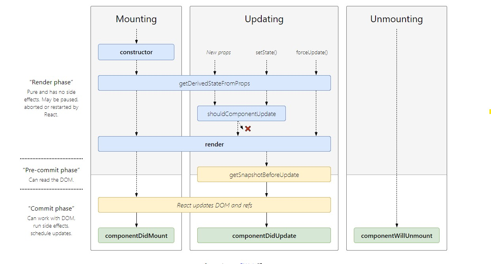

# State and LifeCycle

### State

State is held by a class Component. It is local/encapsulated - only the class component that holds the state can update or modify it. 

A component can choose to pass it's state down to the children in the form of props. The components which receive the state/some-part-of-the-state as props have no idea whether the props came from a state component or a state-less component ➡➡➡➡➡➡➡➡➡ unidirectional data flow. 

**setState\(\)** is used to set the state.

3 vital point's to remember about State:

1. Do Not Modify State Directly 😬!! Use setState\(\) 😀
2. State Updates may be Asynchronous, [check](https://reactjs.org/docs/state-and-lifecycle.html#state-updates-may-be-asynchronous). Also check this [CodeSandBox](https://codesandbox.io/s/async-setstate-5jhzo).
3. State Updates are Merged. This means if the state is a collection of several fields, we can selectively update each field.

### Lifecycle

Check the [CodeSandbox](https://codesandbox.io/s/timer-to-illustrate-life-cycle-methods-in-react-uh13j) to get an insight 😃

Each component has several “lifecycle methods” that you can override to run code at particular times in the process.

